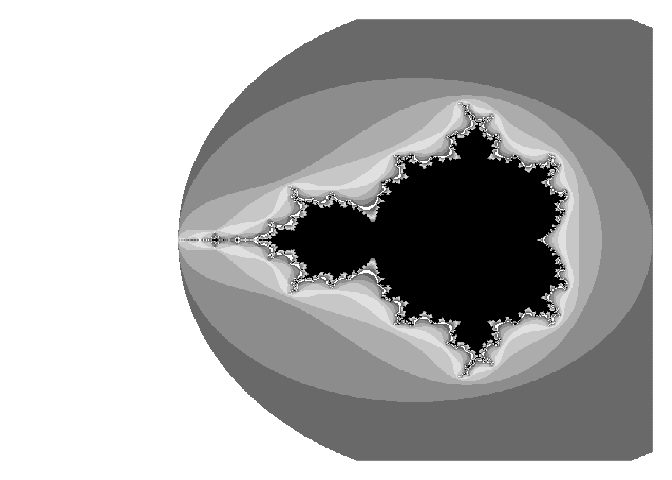
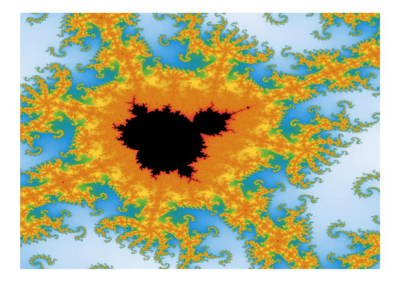

<!-- README.md is generated from README.Rmd. Please edit that file -->


mandelbrot
==========

Curious whether your favourite complex number is a member of the Mandelbrot set?

—No? Then probably you just want to draw pretty pictures.

Install with:

``` r
devtools::install_github("blmoore/mandelbrot")
```

Examples
--------

``` r
library(mandelbrot)

mb <- mandelbrot()
plot(mb, asp = 1)
```



Trippy colours:

``` r
mb <- mandelbrot(xlim = c(-0.8438146, -0.8226294),
                 ylim = c(0.1963144, 0.2174996), 
                 iterations = 500)

cols <- mandelbrot_palette(RColorBrewer::brewer.pal(11, "Spectral"))
plot(mb, col = cols)
```


Don't like `image`? Convert to a `data.frame` and use with ggplot2:

``` r
library(ggplot2)

mb <- mandelbrot(xlim = c(-0.8335, -0.8325),
                 ylim = c(0.205, 0.206), 
                 resolution = 1200L,
                 iterations = 1000)

# weird uneven palette made for a heatmap viz:
# https://benjaminlmoore.wordpress.com/2015/04/09/recreating-the-vaccination-heatmaps-in-r/
cols <- c(
  colorRampPalette(c("#e7f0fa", "#c9e2f6", "#95cbee",
                     "#0099dc", "#4ab04a", "#ffd73e"))(10),
  colorRampPalette(c("#eec73a", "#e29421", "#e29421", 
                     "#f05336","#ce472e"), bias=2)(90), 
  "black")

df <- as.data.frame(mb)
ggplot(df, aes(x = x, y = y, fill = value)) +
  geom_raster(interpolate = TRUE) + theme_void() +
  scale_fill_gradientn(colours = cols, guide = "none")
```



Credits
-------

-   Wraps original R / C code by [mariodosreis](https://github.com/mariodosreis) (see R package [fractal](https://github.com/mariodosreis/fractal)).
